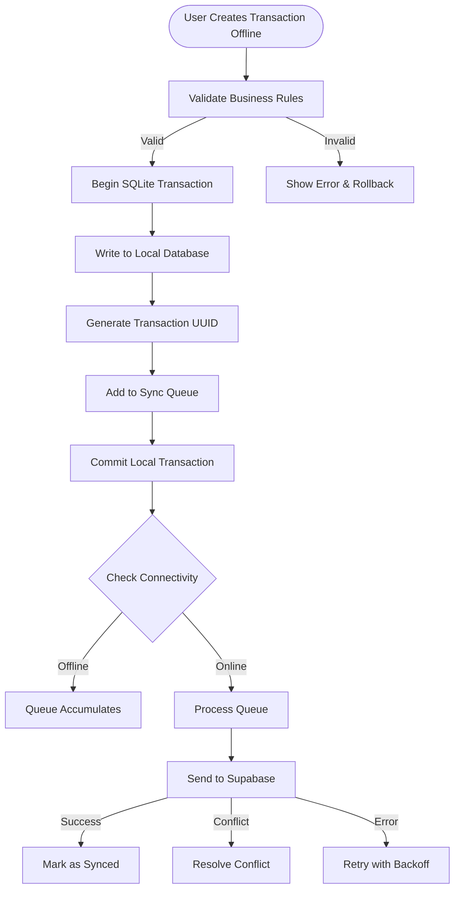
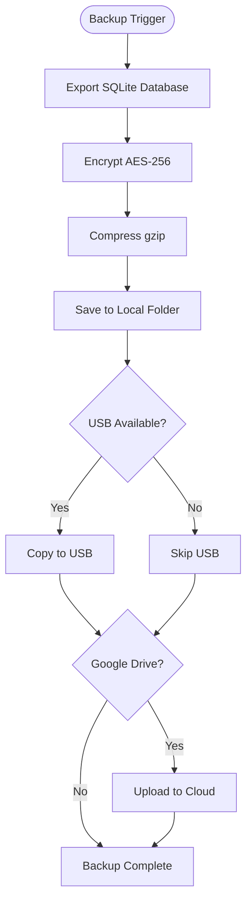
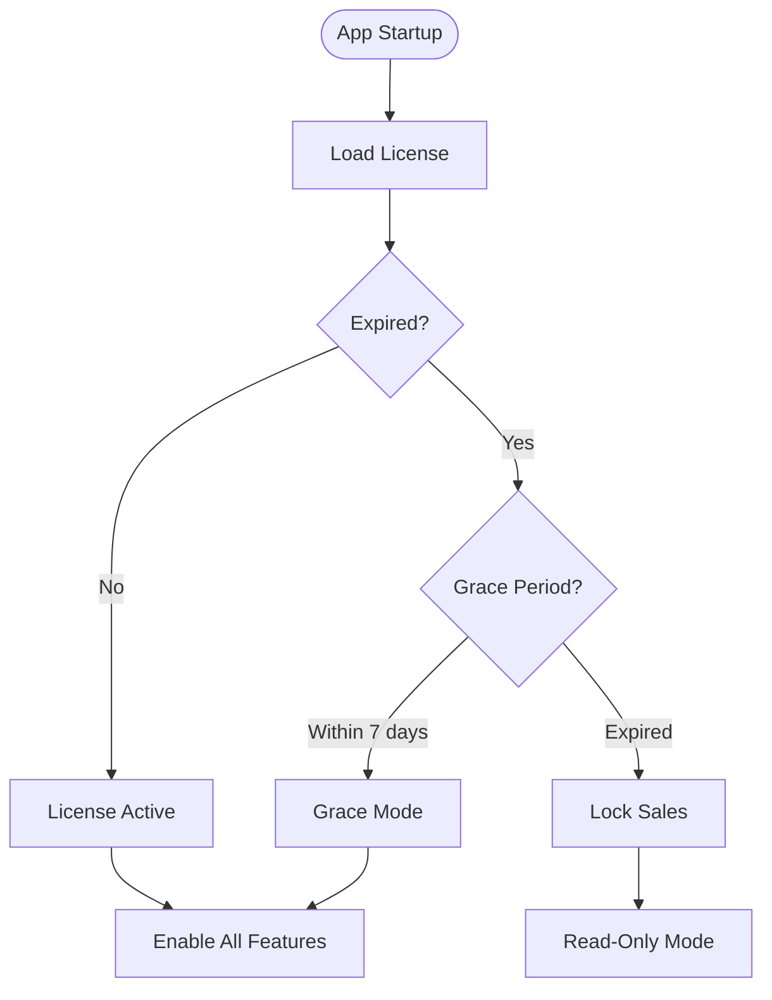
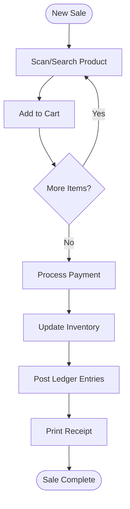
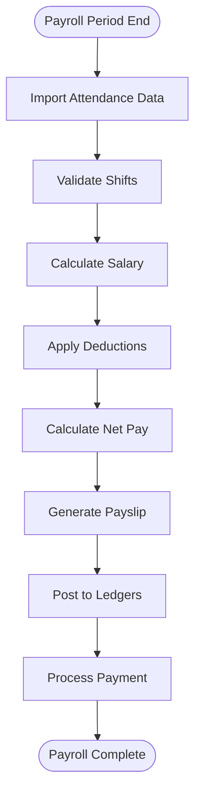
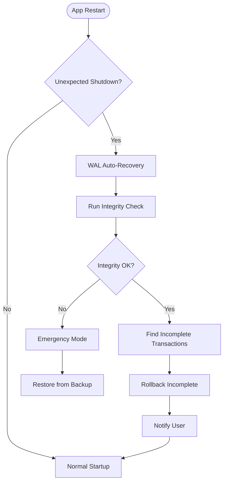
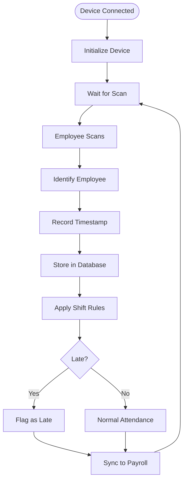
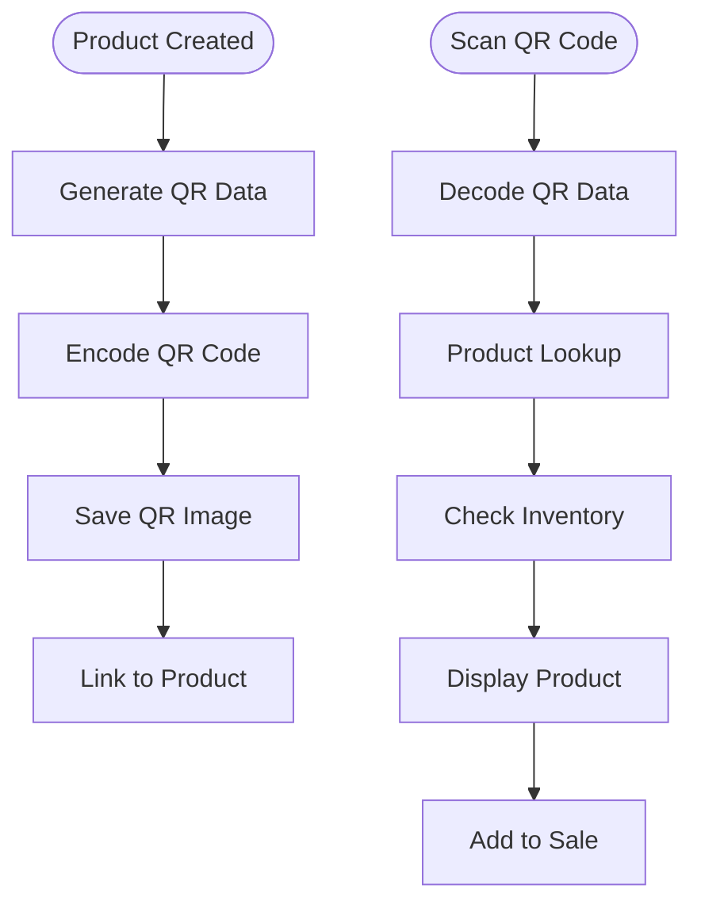
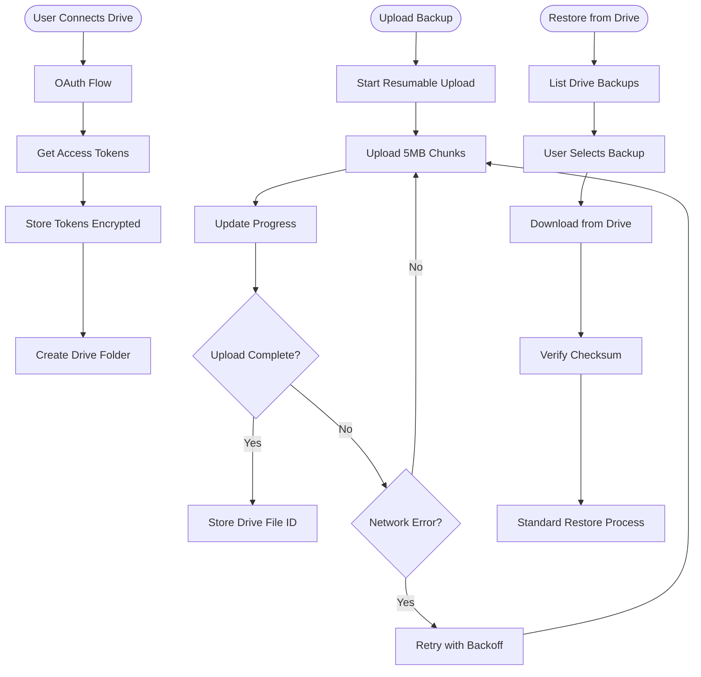
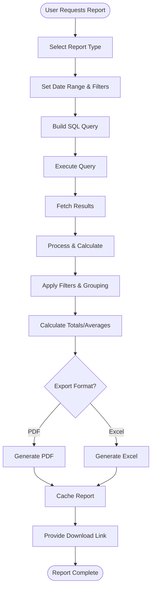

# FlexPOS - Critical Data Flow Diagrams

**Project:** FlexPOS - Offline-first POS SaaS for Pakistani SMBs (Windows)  
**Document Version:** 1.0  
**Phase:** 1 - Design Phase  
**Last Updated:** December 2024

---

## Table of Contents

1. [Offline Sync Data Flow](#1-offline-sync-data-flow)
2. [Backup & Restore Data Flow](#2-backup--restore-data-flow)
3. [Licensing & Expiry Data Flow](#3-licensing--expiry-data-flow)
4. [Transaction Processing Data Flow](#4-transaction-processing-data-flow)
5. [Payroll Calculation Data Flow](#5-payroll-calculation-data-flow)
6. [System Failure & Recovery Data Flow](#6-system-failure--recovery-data-flow)
7. [Biometric Attendance Data Flow](#7-biometric-attendance-data-flow)
8. [QR Code Generation & Scanning Data Flow](#8-qr-code-generation--scanning-data-flow)
9. [Google Drive Backup Sync Data Flow](#9-google-drive-backup-sync-data-flow)
10. [Report Generation Data Flow](#10-report-generation-data-flow)

---

## Overview

This document describes the complete data flow for all critical operations in the FlexPOS system. Each flow documents data movement, transformations, error handling, and safety mechanisms to ensure zero data loss and enterprise-grade reliability.

**Key Principles:**
- **Offline First:** All operations complete locally before attempting sync
- **Zero Data Loss:** Every operation has rollback and recovery mechanisms
- **Atomic Operations:** Transactions are all-or-nothing
- **Audit Trail:** All critical operations are logged with timestamps
- **Performance Targets:** Operations complete within specified time constraints
- **Safety First:** Multiple validation points and integrity checks

---

## 1. Offline Sync Data Flow

### 1.1 Overview

The offline sync mechanism ensures that all local transactions are synchronized with the cloud (Supabase) when internet connectivity is available. This is a core feature of the offline-first architecture.

### 1.2 Data Flow Narrative

When users perform operations offline (sales, purchases, inventory adjustments), these transactions are immediately persisted to the local SQLite database and added to a sync queue. A background service continuously monitors internet connectivity. When connection is detected, it processes the sync queue in priority order, uploading transactions to Supabase. Conflicts are detected by comparing timestamps and version numbers, resolved using predefined rules (last-write-wins with business validation), and the local database is updated to reflect the synchronized state.

### 1.3 Mermaid Diagram

### 1.4 Performance Targets

- Local Transaction Commit: < 500ms
- Single Transaction Sync: < 5 seconds
- Batch Sync (10 items): < 30 seconds

---

## 2. Backup & Restore Data Flow

### 2.2 Data Flow Narrative

Backups are triggered automatically (daily at 2 AM, weekly on Sunday, on application exit) or manually by users. The backup process exports the entire SQLite database, encrypts it using AES-256, compresses it with gzip, and saves to configured destinations (local folder, USB drive, Google Drive).

### 2.3 Mermaid Diagram

---

## 3. Licensing & Expiry Data Flow

### 3.1 Overview

The licensing system controls access to FlexPOS features based on subscription status with a 7-day grace period.

### 3.2 Mermaid Diagram

---

## 4. Transaction Processing Data Flow

### 4.1 Overview

Complete POS sale transaction from product selection to receipt printing.

### 4.2 Mermaid Diagram

---

## 5. Payroll Calculation Data Flow

### 5.1 Overview

Complete payroll cycle from attendance to payment processing.

### 5.2 Data Flow Narrative

Attendance data is input from biometric devices or manually. The system validates shifts, applies late/early rules, and handles manual overrides with reason logging. Salary calculation processes monthly salary, daily/hourly rates, and overtime. Advances and deductions are applied, payslips generated, ledger postings created, and payments processed.

### 5.3 Step-by-Step Sequence

1. **Attendance Input**: Import from biometric device or manual entry
2. **Shift Validation**: Validate against shift schedules
3. **Late/Early Detection**: Apply rules for late arrivals/early departures
4. **Manual Overrides**: Allow authorized overrides with reason logging
5. **Salary Calculation**: Calculate monthly/daily/hourly rates
6. **Overtime Calculation**: Calculate overtime hours and rates
7. **Advances Deduction**: Deduct employee advances
8. **Other Deductions**: Apply other deductions (taxes, loans, etc.)
9. **Net Salary Calculation**: Calculate final net pay
10. **Payslip Generation**: Generate detailed payslip
11. **Ledger Posting**: Post to employee advance and expense ledgers
12. **Payment Processing**: Process payment (cash/bank transfer)
13. **Backup Trigger**: Trigger automatic backup
14. **Report Generation**: Generate payroll reports

### 5.4 Mermaid Diagram

### 5.5 Performance Targets

- Attendance validation: < 100ms per employee
- Salary calculation: < 500ms per employee
- Batch payroll (50 employees): < 30 seconds

---

## 6. System Failure & Recovery Data Flow

### 6.1 Overview

Power failure and crash recovery mechanisms to ensure data integrity.

### 6.2 Data Flow Narrative

On application restart after unexpected shutdown, the system checks for incomplete transactions using SQLite's Write-Ahead Logging (WAL). It runs database integrity checks, identifies incomplete transactions, and either completes or rolls them back. User is notified of recovery actions, and automatic retry logic handles recoverable errors.

### 6.3 Step-by-Step Sequence

1. **Application Restart**: Detect unexpected shutdown
2. **WAL Recovery**: SQLite automatically recovers from WAL file
3. **Integrity Check**: Run PRAGMA integrity_check
4. **Identify Incomplete Transactions**: Check for transactions in intermediate state
5. **Transaction Analysis**: Determine if completable or must rollback
6. **Rollback Incomplete**: Rollback transactions that cannot be completed
7. **Complete Partial**: Complete transactions with sufficient data
8. **Update Status**: Update transaction statuses
9. **User Notification**: Inform user of recovery actions
10. **Backup Verification**: Verify last backup integrity
11. **Audit Log**: Log all recovery actions
12. **Manual Review Queue**: Flag transactions requiring manual review

### 6.4 Mermaid Diagram

### 6.5 Safety Mechanisms

1. **SQLite WAL Mode**: Automatic recovery from crashes
2. **Database Integrity Checks**: Detect corruption early
3. **Transaction Rollback**: Atomic rollback of incomplete operations
4. **Backup Verification**: Ensure backup usable for recovery
5. **Audit Trail**: Complete log of all recovery actions
6. **Manual Review**: Human verification for critical recoveries

---

## 7. Biometric Attendance Data Flow

### 7.1 Overview

HID biometric device integration for employee attendance tracking.

### 7.2 Data Flow Narrative

The system initializes connection with HID biometric device, captures attendance records (employee ID, timestamp), stores raw data locally, applies shift rules, detects late/early arrivals, allows manual overrides with audit trail, syncs with payroll module, and generates reports.

### 7.3 Step-by-Step Sequence

1. **Device Connection**: Initialize HID device connection (USB)
2. **Device Handshake**: Verify device firmware and compatibility
3. **Employee Enrollment**: Store employee biometric data in device
4. **Attendance Capture**: Device captures fingerprint/face scan
5. **Employee Identification**: Device returns employee ID
6. **Timestamp Recording**: Record exact timestamp of punch
7. **Store Raw Data**: Insert into attendance_raw table
8. **Shift Matching**: Match punch to employee's shift schedule
9. **Late Detection**: Compare punch time with shift start time
10. **Early Departure Detection**: Compare punch out with shift end time
11. **Exception Handling**: Flag attendance exceptions
12. **Manual Override**: Allow supervisor to override with reason
13. **Audit Trail**: Log all overrides with approver details
14. **Sync to Payroll**: Make available for payroll calculation
15. **Report Generation**: Generate attendance reports
16. **Device Disconnection Handling**: Handle device removal gracefully

### 7.4 Mermaid Diagram

### 7.5 Performance Targets

- Device initialization: < 3 seconds
- Fingerprint identification: < 2 seconds
- Database storage: < 100ms
- Shift rule application: < 50ms per record

---

## 8. QR Code Generation & Scanning Data Flow

### 8.1 Overview

QR code lifecycle for product identification and transaction processing.

### 8.2 Data Flow Narrative

When products are created or updated, the system generates QR codes containing product ID and essential details. QR codes are stored as images or data strings. At POS, scanning QR codes triggers product lookup, retrieves pricing and inventory, displays stock information, and adds items to sale. QR codes can also be used for reports and receipts. Webcam fallback is available if dedicated scanner unavailable.

### 8.3 Step-by-Step Sequence

**QR Code Generation:**

1. **Product Creation**: New product added to system
2. **Generate QR Data**: Create data string with product ID, SKU
3. **Encode QR Code**: Use QR encoding library (e.g., qrcode, ZXing)
4. **Generate Image**: Create QR code image (PNG, 300x300px)
5. **Store QR Code**: Save image to file system or database blob
6. **Link to Product**: Store QR code path/data in product record
7. **Print QR Label**: Generate printable label with QR code

**QR Code Scanning:**

8. **Scanner Ready**: QR scanner connected (USB or webcam)
9. **Scan QR Code**: User scans product QR code
10. **Decode QR Data**: Extract product ID from QR data
11. **Product Lookup**: Query database for product by ID
12. **Retrieve Product Details**: Load price, name, inventory
13. **Check Inventory**: Verify stock availability
14. **Display Product Info**: Show product details on screen
15. **Add to Sale**: Add product to current transaction
16. **Update UI**: Refresh POS screen with added item

### 8.4 Mermaid Diagram

### 8.5 Performance Targets

- QR generation: < 200ms per code
- QR scanning: < 1 second
- Product lookup after scan: < 100ms

---

## 9. Google Drive Backup Sync Data Flow

### 9.1 Overview

Cloud backup integration with Google Drive for automated offsite backups.

### 9.2 Data Flow Narrative

OAuth authentication flow establishes secure connection to Google Drive. Initial backup uploads create folder structure. Incremental sync strategy minimizes upload time. Large files are handled with resumable uploads. Network failures trigger automatic retry. Conflicts between local and cloud backups are resolved using timestamps. Restore from Google Drive downloads and verifies backups. Access can be revoked through OAuth token management.

### 9.3 Step-by-Step Sequence

**OAuth Authentication:**

1. **User Initiates**: User clicks "Connect Google Drive"
2. **OAuth Flow Start**: Open browser for Google OAuth consent
3. **User Authorization**: User grants FlexPOS access to Drive
4. **Receive Auth Code**: Google redirects with authorization code
5. **Exchange for Tokens**: Exchange code for access + refresh tokens
6. **Store Tokens**: Securely store tokens in local database (encrypted)
7. **Test Connection**: Verify access by listing Drive folders

**Initial Backup Upload:**

8. **Create Backup Folder**: Create /FlexPOS_Backups/{business_id}/ in Drive
9. **Select Backup File**: Choose backup file to upload
10. **Initiate Upload**: Start resumable upload session with Drive API
11. **Upload in Chunks**: Send file in 5MB chunks
12. **Monitor Progress**: Update progress bar for user
13. **Handle Interruptions**: Resume from last successful chunk if network fails
14. **Verify Upload**: Confirm file uploaded completely
15. **Store File ID**: Save Google Drive file ID in local metadata
16. **Upload Metadata**: Upload corresponding .meta.json file

**Incremental Sync:**

17. **List Local Backups**: Query local backup_history table
18. **List Drive Backups**: Query Google Drive folder for existing backups
19. **Compare Timestamps**: Identify new local backups not in Drive
20. **Upload New Backups**: Upload only new backups since last sync
21. **Update Sync Status**: Mark backups as synced to cloud

**Large File Handling:**

22. **Check File Size**: If file > 100MB, use resumable upload
23. **Create Upload Session**: Initiate resumable upload session
24. **Split into Chunks**: Divide file into 5MB chunks
25. **Upload with Retry**: Upload each chunk with automatic retry
26. **Track Progress**: Store chunk upload progress locally
27. **Resume After Failure**: If interrupted, resume from last chunk

**Network Failure Recovery:**

28. **Detect Failure**: Network error during upload
29. **Store State**: Save upload session ID and last successful chunk
30. **Exponential Backoff**: Wait before retry (2^attempt seconds)
31. **Resume Upload**: Continue from last successful chunk
32. **Maximum Retries**: After 5 failures, mark as failed, notify user

**Restore from Google Drive:**

33. **User Initiates**: User selects "Restore from Google Drive"
34. **List Drive Backups**: Query Drive folder, display backups
35. **User Selection**: User selects backup to restore
36. **Download Backup**: Download backup file from Drive
37. **Show Progress**: Display download progress
38. **Verify Checksum**: Validate downloaded file integrity
39. **Proceed to Restore**: Follow standard restore process (Section 2)

### 9.4 Mermaid Diagram

### 9.5 Safety Mechanisms

1. **OAuth Token Encryption**: Tokens stored encrypted in local database
2. **Token Refresh**: Automatic refresh of expired access tokens
3. **Resumable Uploads**: Resume interrupted uploads from last chunk
4. **Checksum Verification**: Validate file integrity after download
5. **Retry Logic**: Exponential backoff for network errors
6. **Access Revocation**: User can revoke Drive access anytime

---

## 10. Report Generation Data Flow

### 10.1 Overview

Comprehensive reporting system for business intelligence and compliance.

### 10.2 Data Flow Narrative

User requests a report by selecting report type, date range, and filters. System aggregates data from relevant tables (sales, inventory, payroll, etc.), applies filters and grouping, performs calculations (totals, averages, margins), formats output for selected export format (PDF or Excel), caches generated report for quick re-access, and provides download link.

### 10.3 Step-by-Step Sequence

**Report Request:**

1. **User Action**: User opens Reports module
2. **Select Report Type**: Choose from available reports:
   - Sales Summary
   - Profit & Margin Analysis
   - Inventory Valuation
   - Stock Movement
   - Expiry Report
   - Employee Attendance
   - Payroll Report
   - Customer Outstanding
   - Supplier Dues
   - Expense Summary
3. **Set Date Range**: Select start date and end date
4. **Apply Filters**: Optional filters (category, customer, product, employee)
5. **Set Grouping**: Group by (day, week, month, category, etc.)
6. **Preview Options**: Select columns to include/exclude

**Data Aggregation:**

7. **Build SQL Query**: Construct query based on report parameters
8. **Execute Query**: Run query against local SQLite database
9. **Fetch Results**: Retrieve result set
10. **Process Data**: Loop through results, build data structures

**Sales Summary Report:**

11. **Aggregate Sales Data**:
    - Total sales amount
    - Number of transactions
    - Average transaction value
    - Total items sold
    - Sales by payment method
    - Sales by cashier
12. **Calculate Metrics**:
    - Day-over-day growth
    - Top-selling products
    - Peak hours analysis
13. **Group by Date**: Aggregate by selected grouping (daily, weekly, monthly)

**Profit & Margin Report:**

14. **Calculate Cost of Goods Sold**: SUM(sale_items.quantity * sale_items.cost_price)
15. **Calculate Revenue**: SUM(sales.grand_total - sales.tax_amount)
16. **Calculate Gross Profit**: Revenue - COGS
17. **Calculate Margin %**: (Gross Profit / Revenue) * 100
18. **Group by Product/Category**: Show profitability by segment

**Inventory Valuation:**

19. **Current Stock**: Query inventory.quantity_on_hand for all products
20. **Cost Valuation**: SUM(quantity_on_hand * cost_price)
21. **Retail Valuation**: SUM(quantity_on_hand * sale_price)
22. **Potential Profit**: Retail - Cost
23. **Group by Category**: Show valuation by category

**Stock Movement:**

24. **Opening Stock**: Stock at start of period
25. **Purchases**: Items purchased during period
26. **Sales**: Items sold during period
27. **Adjustments**: Inventory adjustments (damage, theft, etc.)
28. **Closing Stock**: Stock at end of period
29. **Formula**: Closing = Opening + Purchases - Sales +/- Adjustments

**Expiry Report:**

30. **Query Products with Expiry**: Products where expiry_date IS NOT NULL
31. **Calculate Days to Expiry**: expiry_date - current_date
32. **Categorize**:
    - Expired (days < 0)
    - Expiring Soon (0-30 days)
    - Safe (> 30 days)
33. **Calculate Value at Risk**: SUM(quantity * cost_price) for expired/expiring

**Employee Attendance Report:**

34. **Query Attendance Records**: For date range and employee filters
35. **Calculate Metrics**:
    - Total days worked
    - Late arrivals count
    - Early departures count
    - Absent days
    - Overtime hours
36. **Group by Employee**: Individual attendance summary

**Payroll Report:**

37. **Query Payroll Records**: For selected pay period
38. **Aggregate**:
    - Total gross salary
    - Total deductions
    - Total net pay
    - Total advances
    - Total overtime
39. **Group by Employee/Department**: Detailed breakdown

**Customer Outstanding Report:**

40. **Query Credit Sales**: Sales where payment_method = 'CREDIT' and status != 'PAID'
41. **Calculate Outstanding**: SUM(grand_total - paid_amount)
42. **Age Analysis**:
    - Current (0-30 days)
    - 30-60 days
    - 60-90 days
    - Over 90 days (bad debt risk)
43. **Group by Customer**: Individual outstanding balances

**Supplier Dues Report:**

44. **Query Purchase Orders**: Unpaid purchases
45. **Calculate Dues**: SUM(total_amount - paid_amount)
46. **Payment Due Dates**: Show upcoming payment obligations
47. **Group by Supplier**: Individual dues breakdown

**Expense Summary Report:**

48. **Query Expense Records**: All expenses in date range
49. **Aggregate by Category**:
    - Rent
    - Utilities
    - Salaries
    - Marketing
    - Supplies
    - Other
50. **Calculate Totals**: Total expenses for period
51. **Compare to Budget**: If budgets defined, show variance

**Filtering and Grouping:**

52. **Apply User Filters**: WHERE clauses based on user selections
53. **Apply Grouping**: GROUP BY clauses (date, category, etc.)
54. **Apply Sorting**: ORDER BY as specified
55. **Pagination**: If large dataset, paginate results

**Calculation:**

56. **Calculate Totals**: SUM aggregations
57. **Calculate Averages**: AVG aggregations
58. **Calculate Percentages**: Ratio calculations
59. **Calculate Growth Rates**: Period-over-period comparisons

**Export Format Selection:**

60. **User Selects Format**: PDF or Excel
61. **If PDF**:
    - Load PDF template
    - Populate with data
    - Apply styling (headers, footers, logo)
    - Generate PDF using library (e.g., PDFKit, wkhtmltopdf)
    - Save to temp folder
62. **If Excel**:
    - Create workbook
    - Create sheet(s)
    - Write headers
    - Write data rows
    - Apply formatting (bold headers, number formats, borders)
    - Add charts (if applicable)
    - Save as .xlsx using library (e.g., ExcelJS, SheetJS)

**Caching:**

63. **Generate Cache Key**: Hash of report parameters (type, date, filters)
64. **Check Cache**: Query if report already generated recently
65. **If Cached**: Serve cached file, update last accessed timestamp
66. **If Not Cached**: Generate new report, save to cache
67. **Cache Expiry**: Cached reports valid for 1 hour

**Report Delivery:**

68. **Save Report File**: Save to reports/ folder with unique filename
69. **Generate Download Link**: Create download URL or file path
70. **Display Success**: Show "Report generated successfully"
71. **Provide Actions**:
    - [Download] button
    - [Email] button (attach report)
    - [Print] button (open in default viewer)
72. **Update Report History**: Log report generation in audit trail

### 10.4 Mermaid Diagram

### 10.5 Performance Targets

- Simple report (< 1000 records): < 3 seconds
- Complex report (< 10000 records): < 10 seconds
- Large report (> 10000 records): < 30 seconds
- PDF generation: < 5 seconds for 20-page report
- Excel generation: < 3 seconds for 1000-row spreadsheet

### 10.6 Safety Mechanisms

1. **Query Timeout**: Cancel queries running > 60 seconds
2. **Memory Management**: Stream large datasets instead of loading all in memory
3. **SQL Injection Prevention**: Use parameterized queries only
4. **Access Control**: Verify user has permission for requested report
5. **Data Masking**: Mask sensitive data based on user role
6. **Audit Trail**: Log all report generations with user and parameters

---

## Document Summary

This document provides comprehensive data flow diagrams for 10 critical FlexPOS operations:

1. **Offline Sync Data Flow**: Queue-based synchronization with conflict resolution
2. **Backup & Restore Data Flow**: Multi-destination encrypted backups with integrity verification
3. **Licensing & Expiry Data Flow**: 7-day grace period with online/offline renewal options
4. **Transaction Processing Data Flow**: Complete POS sale with inventory and ledger updates
5. **Payroll Calculation Data Flow**: Attendance to payment with automated calculations
6. **System Failure & Recovery Data Flow**: WAL-based recovery with rollback mechanisms
7. **Biometric Attendance Data Flow**: HID device integration with shift validation
8. **QR Code Generation & Scanning Data Flow**: Product identification and quick lookup
9. **Google Drive Backup Sync Data Flow**: OAuth-based cloud sync with resumable uploads
10. **Report Generation Data Flow**: Comprehensive business intelligence with PDF/Excel export

All flows incorporate:
- **Error handling** with specific rollback mechanisms
- **Performance targets** for optimal user experience
- **Safety mechanisms** to prevent data loss
- **Audit trails** for compliance and debugging
- **Offline vs online behavior** distinctions
- **Module interactions** showing system integration points

This design ensures FlexPOS operates reliably in offline-first environments while maintaining enterprise-grade data integrity and security.

---

**End of Document**
